# Quick Start — Running a Migration from the Console

Cloud-Migrator moves a source computing environment to the cloud through a short, repeatable chain. You register the source, build a **Source Model** from what is running there, get a recommended **Target Model**, generate a **Workflow** from that target model, and run it.

---

## Migration at a glance

A migration runs through five steps, in order. Each one is a screen in the console.

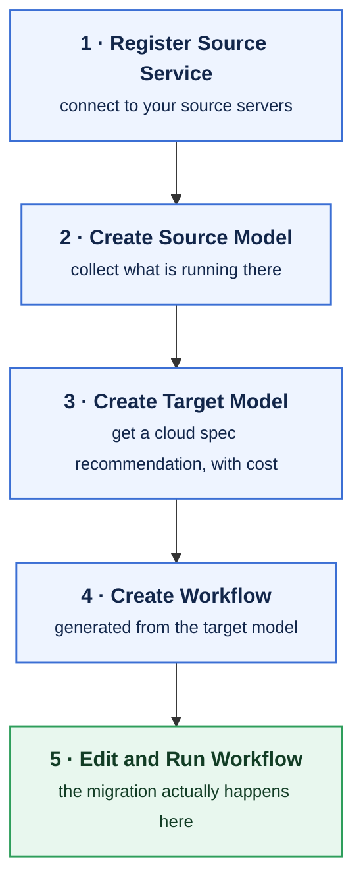

| Step | What you do | Where |
|:----:|-------------|-------|
| **1** | **Register Source Service** — connect to your source servers | Source Computing → Source Services |
| **2** | **Create Source Model** — collect what is running there | Models → Source Models |
| **3** | **Create Target Model** — get a cloud spec recommendation, with cost | Models → Target Models |
| **4** | **Create Workflow** — generated from the target model | Target Model → *Make Workflow* |
| **5** | **Edit and Run Workflow** — the migration actually happens here | Workflow → Run |

Infrastructure migration is steps 1–5. **After it finishes you can also migrate the software** that ran on the source — see [Scenario B](#scenario-b--software-migration).

---

## Before you start

- The integrated lineup is running and you can reach the console. See **How to Run** in the [README](../../README.md).
- Log in with your account. After login you land on the dashboard.

---

## Scenario A — Infrastructure migration

### A1 · Register the source and collect it

The source you migrate is registered under **Source Computing → Source Services**.

**How the pieces fit**

| Term | What it means |
|------|---------------|
| **Source Service** | What you register — a *source group*. Connections always live inside one. |
| **Connection** | **One source server.** Add several to move several servers together. |

Migration normally runs at the **Source Service level**, so every server in it moves together. Working with an individual connection is also possible.

**Steps**

1. Open **Source Computing → Source Services** and create a Source Service.
2. On its **Connections** tab, add a connection for each source server — name, **IP address**, SSH port, user, and a password or private key.
   - To register many at once, import them from a CSV/Excel file — see [Bulk import of source connections](source-connection-bulk-import.md).
   - When a connection is registered, the platform connects to that server over SSH and **installs the collection agent**, then confirms it works. Collection is not possible unless this succeeds.
3. **Press Refresh before collecting.** It re-checks each connection — whether the server is still reachable and whether information can be collected — and updates **Agent Status / Connection Status** on the **Detail** tab.
4. Once the status is healthy, run **Collect Infra**. The collected result opens in a viewer showing the source machine's CPU, memory, disk, and network as JSON.

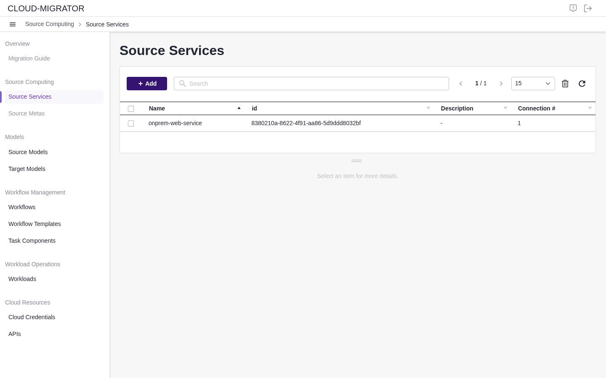

*Detail tab — Agent Status / Connection Status and the Collect buttons.*

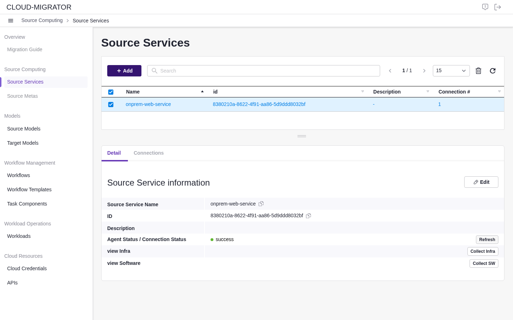

*The collected result opens in a viewer. Press **Convert** to turn it into a model, then **Save**.*

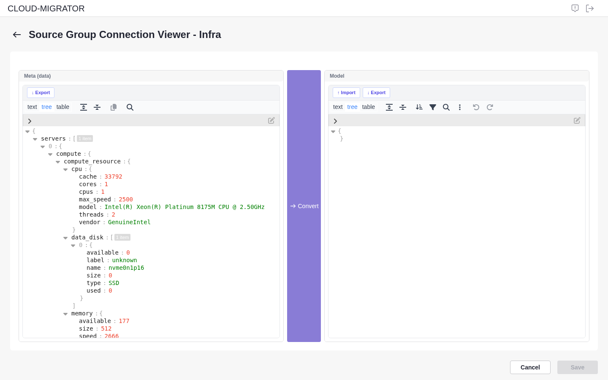

> [!IMPORTANT]
> **Use an address the platform can actually reach.** The agent is installed over SSH from the platform, so the IP you register must be reachable *from the server running Cloud-Migrator* — not merely from your laptop.
>
> - Source server in a **different network** (typical on-premises case): use its **public IP**, and allow SSH (port 22) from the platform server.
> - Source server in the **same private network** as the platform (for example, the same VPC): use its **private IP**. This also survives restarts, whereas a public IP may change.
>
> If collection fails with a connection timeout, this is the first thing to check. You can edit the address later from the connection's **Add / Edit** form, so a wrong choice is recoverable.

> [!IMPORTANT]
> Always Refresh before collecting. Server addresses change, and an earlier success does not mean the server is still reachable now.

### A2 · Save a Source Model

1. From the collected result, **save it as a Source Model**. It appears under **Models → Source Models**.
2. *(Optional)* Saving a source model under a **new name** produces a customized copy you can adjust before recommending.

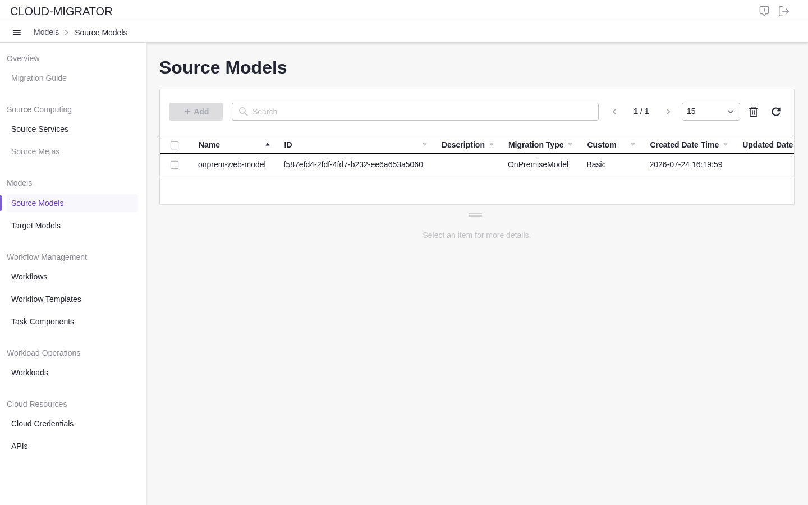

### A3 · Recommend a Target Model

1. Open **Models → Source Models** and select your source model.
2. Run **Recommend Model**. Each candidate shows an **estimated monthly cost**.
3. Choose a candidate and **save it as a Target Model**.

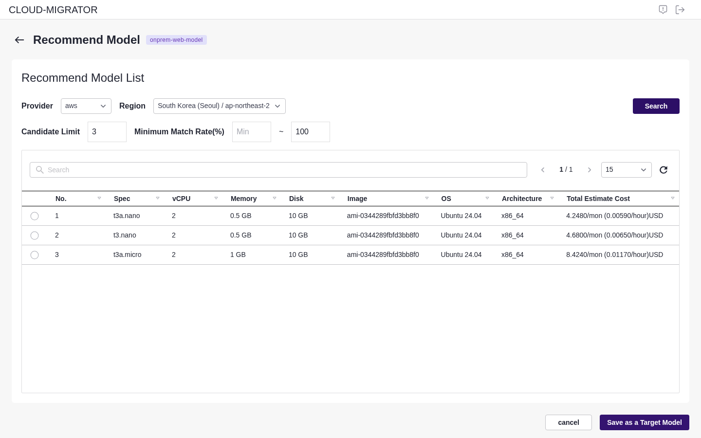

*Each candidate shows an estimated monthly cost, so you can choose by cost.*

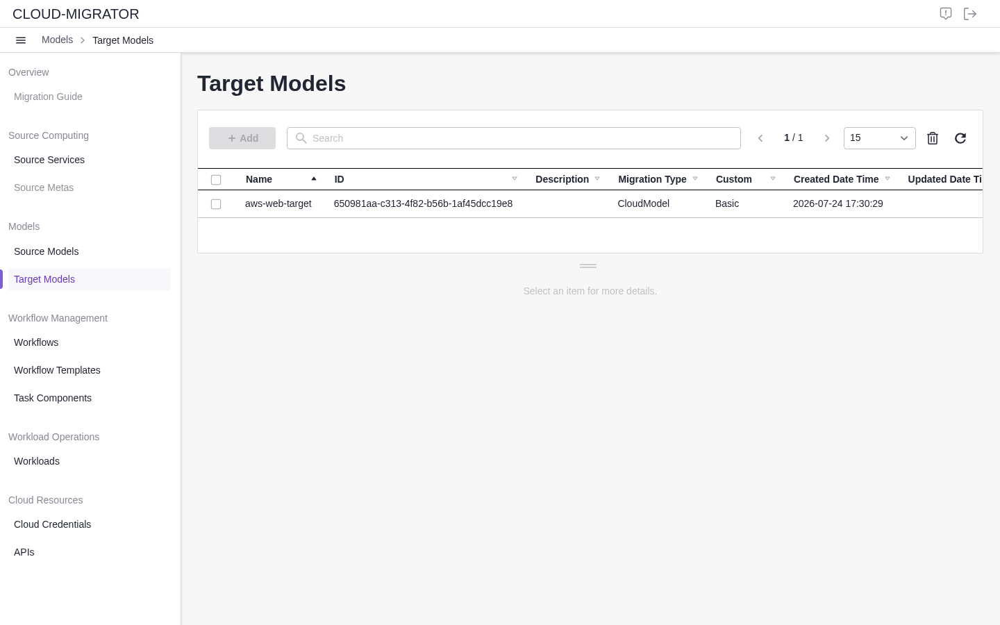

> [!TIP]
> In real use, pick the spec you actually need. **For a first test run**, a migration provisions real cloud resources and therefore costs money — use the cost shown on each candidate to pick a **low-cost (small)** option.

### A4 · Create the Workflow from the Target Model

1. Open your Target Model and choose **Make Workflow** (under *Workflow Tool* on the detail screen). The workflow is **generated automatically from the target model**.
2. Select the **infra_migration** task on the canvas. A **Task Configuration** panel opens on the right, showing the values carried over from the target model — path parameters (such as the namespace), query parameters, and the request body. Review them and edit anything that needs adjusting.
3. *(Optional)* Drag additional components from the **Toolbox** on the left onto the canvas to extend what the workflow does, and edit their properties the same way.
4. Give the workflow a name and **Save**.

> The entry point is the **Make Workflow** link in the *Workflow Tool* row, near the bottom of the Target Model detail — scroll down if you do not see it.

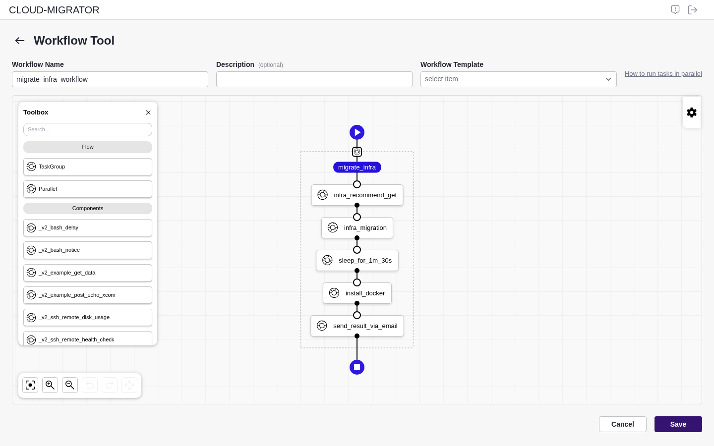

*The workflow is generated for you. Drag more components from the **Toolbox** if needed.*

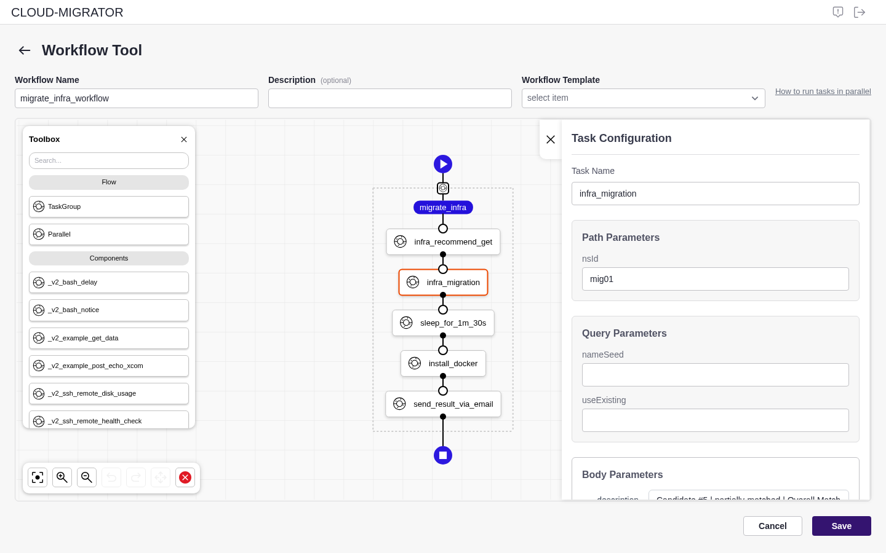

*Selecting a task opens **Task Configuration**, pre-filled from the target model.*

> [!NOTE]
> Today a workflow is created **from a Target Model** — that is the entry point. Building one from scratch on the Workflow list is planned for **v0.7.0**.
>
> For deeper authoring, such as running tasks in parallel, see [Running workflow tasks in parallel](workflow-parallel-steps.md).

### A5 · Run the workflow and watch progress

1. Saving takes you to the **workflow run view**.
2. From there you can **Run**, **edit**, **re-run**, and **check results** — all on one screen.
3. The run view shows the execution graph with **live progress** and failure points. You can re-run a chosen task, everything from a task onward, or only the failed tasks.
4. When the run completes, the infrastructure is created. Find it under **Workload Operations → Workloads → Infra Workloads** — the **Detail** tab shows the infrastructure, the **Server** tab lists its servers.

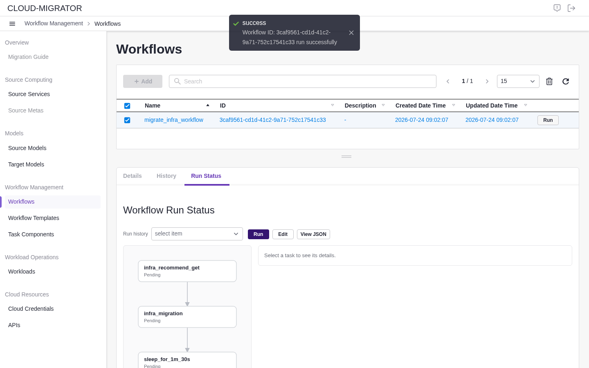

*The **Run Status** tab shows the execution graph with live progress.*

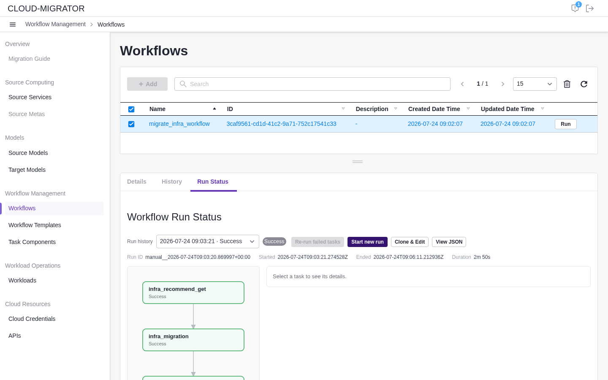

*After a run, **Start new run**, **Clone & Edit**, and **Re-run failed tasks** become available.*

> For what the screen shows at each moment — while a task is running, right after you
> press Run, and when the run cannot be found — see
> [Reading the Run Status Screen](workflow-run-status.md).

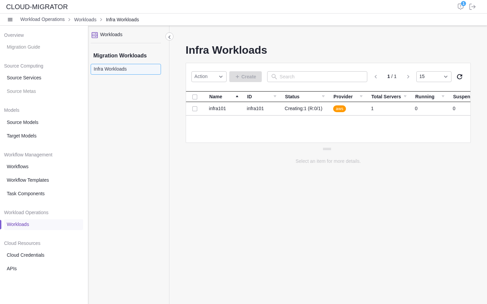

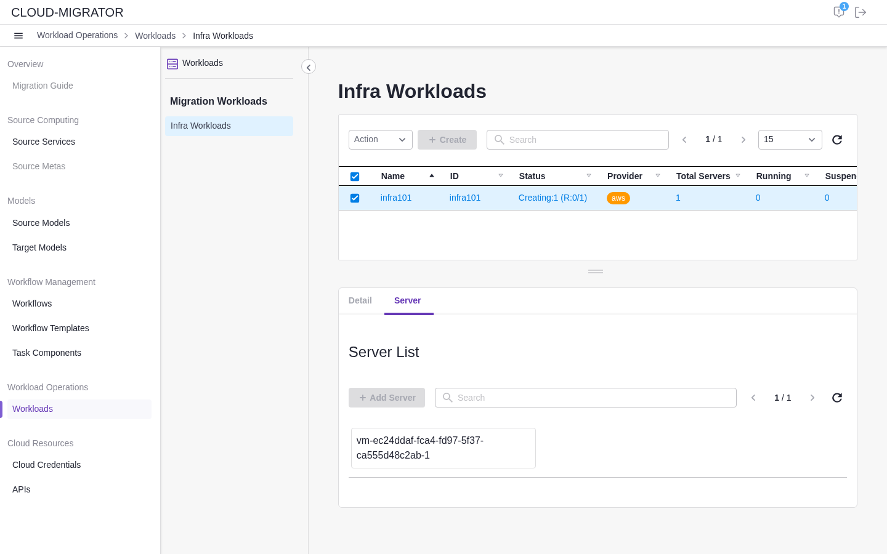

---

## Scenario B — Software migration

> [!NOTE]
> Prerequisite: the target infrastructure already exists (Scenario A). Software migration installs the source software onto it.

1. On the source service's **Detail** tab, press **Refresh**, then run **Collect SW**.
2. In the viewer, press **Convert** and **save the result as a software Source Model**.
3. Open that model and choose **Recommend Model**. On the *Software Migration Recommendation* screen, press **Get Migration List** — the recommended migration fills the right-hand panel. **Save** it as a software Target Model.

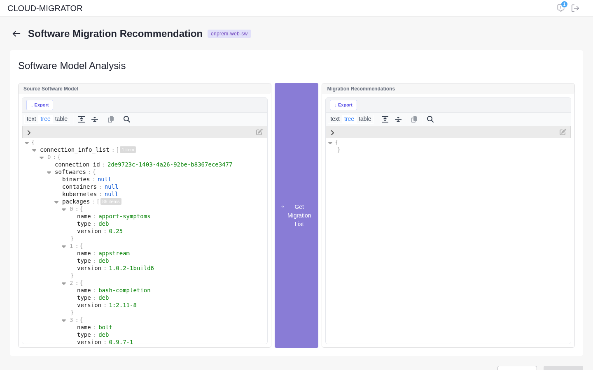
4. Open the software Target Model and choose **Make Workflow**. Select the **run_software_migration** task and check its **Task Configuration** — the install target (`nsId`, `infraId`) is **filled in automatically** from the infrastructure you created. Save the workflow.

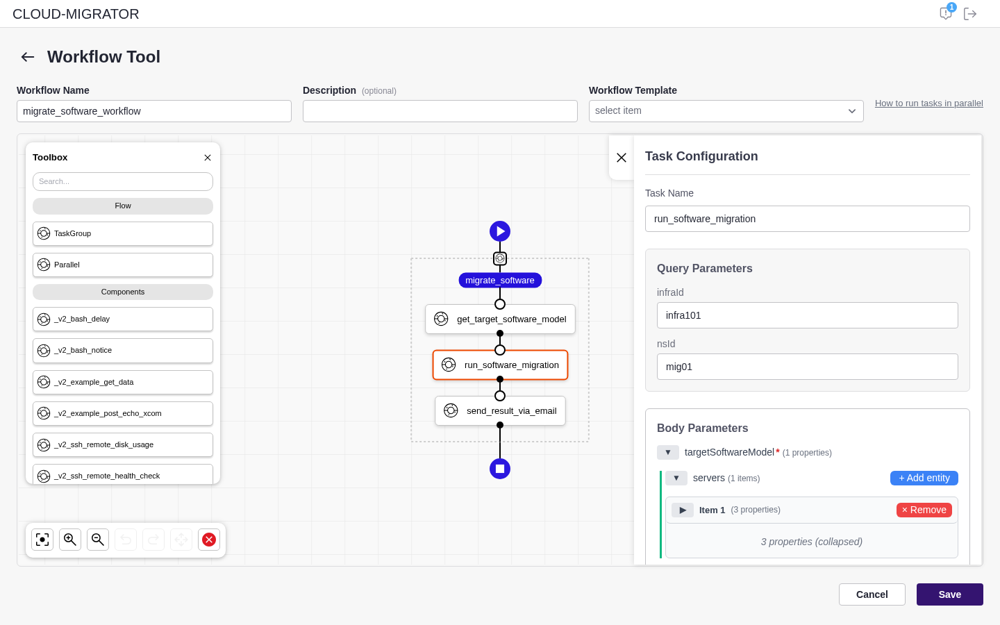
5. **Run** the workflow.
6. Open the workflow's **Run Status** tab, select the **run_software_migration** task, and click **View installed software** under *Result*. The **Software Migration Status** screen lists every piece of software with its version, install type, status, and the target namespace / infra / node.

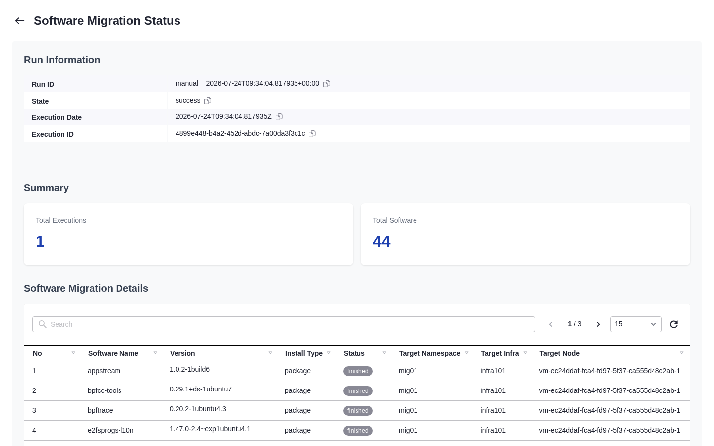

> [!WARNING]
> Per-software success varies — some software installs cleanly, some does not. The run status shows each result as-is, so read the result rather than assuming success from a normal-looking screen.

---

## Scenario C — Doing both

You do not choose between the two. **Run the infrastructure migration first (Scenario A), then the software migration (Scenario B)** onto the infrastructure it created. That combination is what "integrated migration" means.

---

## Load-testing the migrated workload

1. Open **Workload Operations → Workloads → Infra Workloads** and select the migrated workload.
2. Start a **load test**. Progress is shown **live** on screen, and completion or failure is announced in the top-right notification badge.

---

## How it works (for developers)

The links below are **sequence diagrams** showing how the frameworks call each other behind these screens. They are aimed at developers and integrators rather than day-to-day console users.

| Scenario | Diagram |
|----------|---------|
| Computing Infra Migration | [View](https://github.com/cloud-barista/cloud-migrator/blob/main/docs/v0.6.0-user-scenario-for-computing-infra-migration.md) |
| Software Migration | [View](https://github.com/cloud-barista/cloud-migrator/blob/main/docs/v0.6.0-user-scenario-for-software-migration.md) |
| Integrated Migration | [View](https://github.com/cloud-barista/cloud-migrator/blob/main/docs/v0.6.0-user-scenario-for-integrated-migration.md) |
| Data Migration | [View](https://github.com/cloud-barista/cloud-migrator/blob/main/docs/v0.6.0-user-scenario-for-data-migration.md) |
| Object Storage Migration | [View](https://github.com/cloud-barista/cloud-migrator/blob/main/docs/v0.6.0-user-scenario-for-object-storage-migration.md) |
