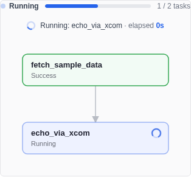
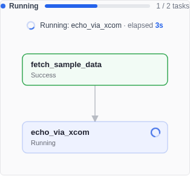
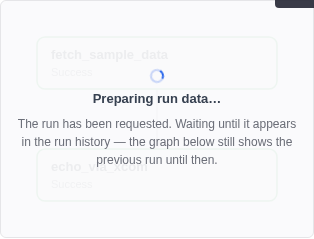
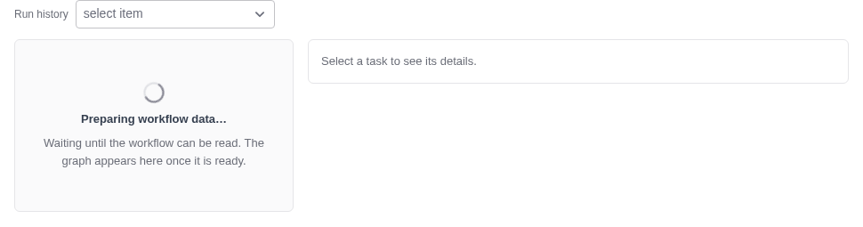
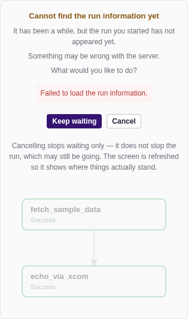

# Reading the Run Status Screen

Select a workflow and the console opens on **Run Status**. This is where you start a
run, watch it, find out why something failed, and run parts of it again.

This guide explains what the screen shows at each moment — including the moments when
it is waiting for something and cannot show you the graph yet.

---

## What is on the screen

| Area | What it tells you |
|------|-------------------|
| **Run history** (top left) | Which run you are looking at. Past runs are listed newest first |
| Status badge | The state of that run — Running, Success, Failed |
| **Auto-refreshing · 3s** | The screen is asking the engine for the current state. It stops on its own once the run finishes |
| Action buttons (top right) | What you can do with this workflow. The set changes with the workflow's history — see [below](#the-buttons-change-with-the-workflow) |
| Run ID · Started · Ended · Duration | Details of the run you picked, kept on screen after the dropdown collapses |
| Progress bar | How many of the workflow's tasks have finished. Shown **only while the run is going** |
| Graph | Every task and the order they run in. Colour shows each task's state |
| Detail panel (right) | The task you selected — its state, timings, parameters, logs, and results |

---

## While a task is running

A workflow with real work in it can sit on one task for a long time. An infrastructure
migration task can take ten minutes on its own.

The progress bar only moves when a task **finishes**, so during those ten minutes it
would not move at all. To make it clear that the run is alive, the screen shows two
things that keep changing.

*A spinner on the running task box says which task the run is sitting on. Above the
graph, the same spinner appears with the task's name and how long it has been running.*

*The same task a few seconds later. **The elapsed time is the point** — a spinner tells
you something is alive, but only the elapsed time tells you whether the wait is normal.*

Between one task finishing and the next starting there is a short moment when nothing is
running. The screen says so rather than naming a task that is not there, and the elapsed
time then counts from the start of the run instead.

---

## Right after you press Run

Starting a run is not instant. The engine accepts the request immediately, but the new
run does not appear in the run history the moment it is created, and reading too early
would show you the **previous** run as if it were the new one.

*The graph is dimmed and the screen says it is preparing. The graph underneath is still
the previous run until the new one is ready — the notice says so.*

This normally clears in well under a second. The screen does not wait a fixed number of
seconds; it asks the engine until the new run actually exists, then draws it.

### Right after you save a workflow

Saving takes you straight to this screen, but a newly created workflow is unreadable for
a few seconds while the engine registers it.

*The screen says it is preparing the workflow data, rather than showing an empty graph.*

An empty graph would read as "this workflow has no tasks", which is not true — the tasks
are there, they just cannot be read yet. The two states say different things on purpose:
**this** one is waiting for the workflow itself, while the one above is waiting for a run
of a workflow it can already read.

Notice there are no action buttons yet. Which buttons belong on screen depends on whether
the workflow has ever run, and that is exactly what cannot be read at this moment — so the
screen offers none rather than guess. They appear as soon as it is ready.

---

## When the run cannot be found

If the run still has not appeared after thirty seconds, something is wrong — the server
may be unreachable or the engine may be stuck.

*The screen says what it knows, shows the reason if the query itself failed, and asks
what you want to do.*

**It does not say the run failed.** The engine accepted the request and may be running
the workflow right now. All the screen knows is that it could not confirm it, so that is
all it claims.

| Choice | What happens |
|--------|--------------|
| **Keep waiting** | Waits again, and draws the run as soon as it appears |
| **Cancel** | Stops waiting. **It does not stop the run** — the workflow may still be going. The screen is refreshed so it shows where things actually stand |

Cancelling and refreshing is often how you find out the run did start after all.

---

## When the run has finished

The progress bar and the running indicators disappear once the run reaches a final
state. Leaving a full progress bar on screen would keep asking "is something still
running?", and the answer is already in the status badge and the colours of the graph.

---

## What the task colours mean

| Colour | State |
|--------|-------|
| Blue, with a spinner | Running |
| Green | Success |
| Red | Failed |
| Amber | Could not run because an earlier task failed |
| Yellow | Waiting to be retried |
| Grey | Not started, or skipped |

A task that could not run is deliberately distinguished from one that failed. **The place
to look is the task that failed upstream**, not this one.

---

## Looking into a task

Select any box in the graph and the panel on the right shows that task.

- **State, try count, timings** — including how many attempts it took
- **Result** — what the task produced, when the engine reports one. Software migration
  tasks show the installed software here. Tasks that produce nothing say so, rather
  than leaving an empty area that reads as "nothing was installed"
- **Logs** — per attempt, so you can compare before and after a re-run. If the log
  contains a failure, the cause is pulled out and shown above the full log
- **Parameters** — the values on the task. These come from the **current definition**,
  so if the workflow was edited after the run, the screen warns that they may differ
  from what the run actually used

### Running part of it again

From a selected task you can re-run **that task only**, or **that task and everything
after it**. For a whole run, **Re-run failed tasks** picks up the tasks that failed and
the ones that were blocked by them.

Nothing runs until you confirm. The engine decides which tasks are affected — not the
picture on screen — so the list you are asked to confirm is the list the engine
returned, and those tasks are highlighted on the graph while you decide.

> Re-running does the work again on the target systems. That is the reason for the
> confirmation step.

---

## The buttons change with the workflow

| Workflow | Buttons |
|----------|---------|
| Never run | **Run**, **Edit** |
| Has run before | **Re-run failed tasks**, **Start new run**, **Clone & Edit** |

There is no **Edit** once a workflow has run. The engine does not keep the definition
each run used, so editing the original would make its past runs display values they
never ran with. **Clone & Edit** copies the workflow and opens the copy, leaving the
original and its history untouched.

**View JSON** is always available, since it only reads.

---

## Related guides

- [Quick Start — Running a Migration from the Console](quick-start-migration.md)
- [Running Workflow Tasks in Parallel](workflow-parallel-steps.md)
